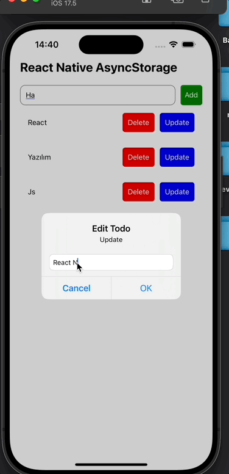

<h1>React Native AsyncStorage Todo Uygulaması</h1>

Bu, verilerin kalıcı depolanması için AsyncStorage kullanımını gösteren, React Native ile oluşturulmuş basit bir Todo uygulamasıdır. Uygulama, kullanıcıların yeni todo eklemelerine, mevcut todoları güncellemelerine ve silmelerine olanak tanır.

<h2>Özellikler</h2>

- Yeni bir todo ekleyin
- Mevcut bir todoyu güncelleyin
- Bir todoyu silin
- Todoları AsyncStorage kullanarak kalıcı hale getirin

<h2>Ekran Görüntüsü</h2>

